# NEAT-Backprop: Neuroevolution with Backpropagation


This project implements a hybrid neuroevolution algorithm that combines NEAT (NeuroEvolution of Augmenting Topologies) with backpropagation for evolving neural networks on classic classification tasks. The system evolves both the topology and weights of neural networks, and further optimizes weights using gradient descent.

## Example Results

### XOR


### Two Circles


### Two Gaussians


### Spiral


## Features

- Evolve neural network architectures and weights using NEAT
- Backpropagation for fine-tuning weights within each generation
- Supports multiple 2D classification tasks: XOR, two circles, two gaussians, spiral
- Visualizes both the network architecture and decision boundary during evolution

## How to Run

1. **Install requirements:**
   ```bash
   pip install -r requirements.txt
   ```
2. **Run training:**

   ```bash
   python train.py
   ```

   You can edit `train.py` to change the task (e.g., 'xor', 'two_circles', 'two_gaussians', 'spiral') and other parameters.

3. **Results:**
   - Combined plots of network architecture and decision boundary are saved in the `results/` directory for each task and generation.

## More Results

Other generations and tasks:

#### XOR

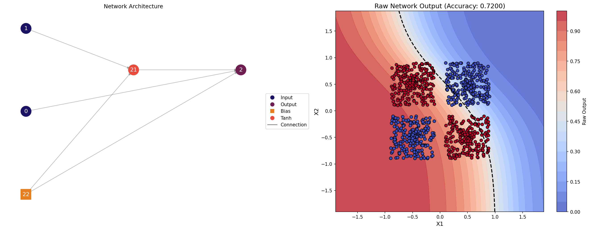

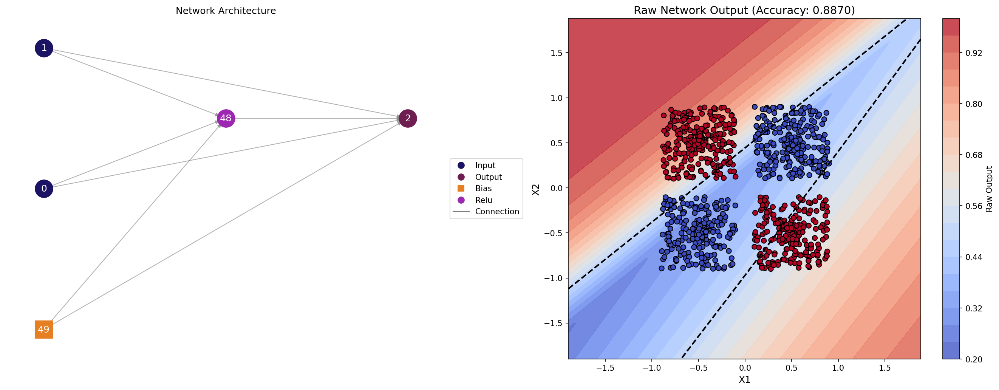
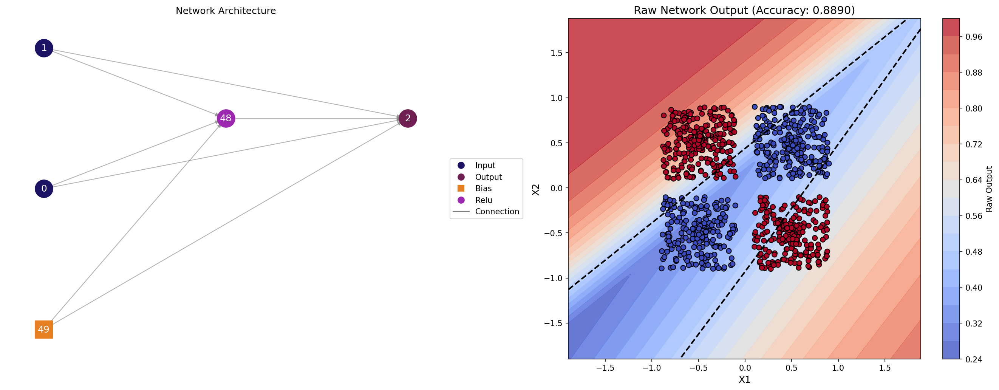
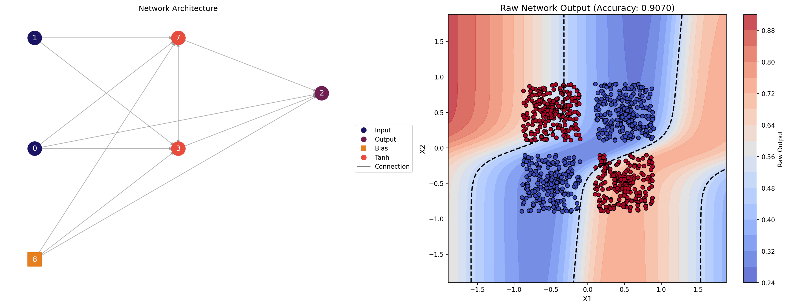
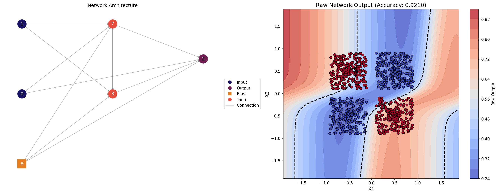
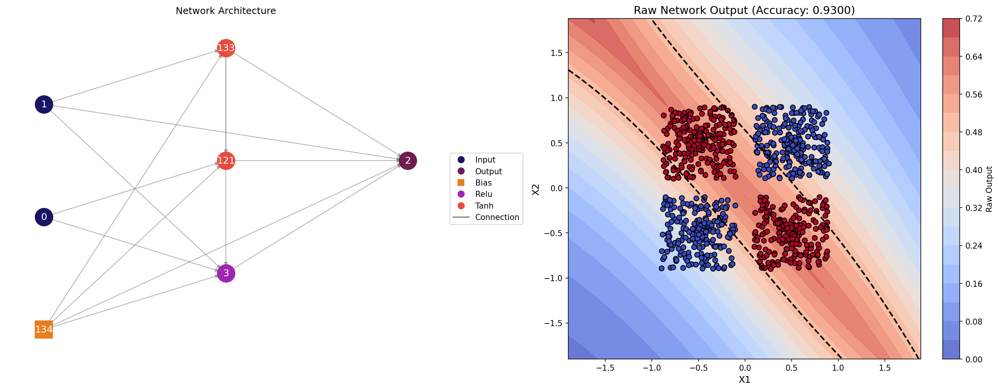
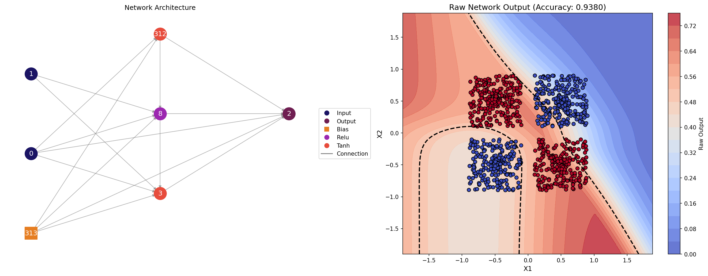
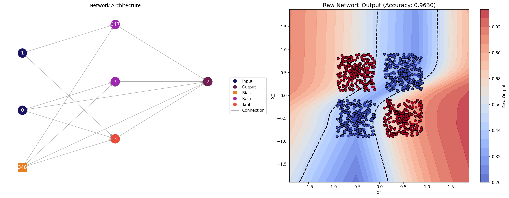
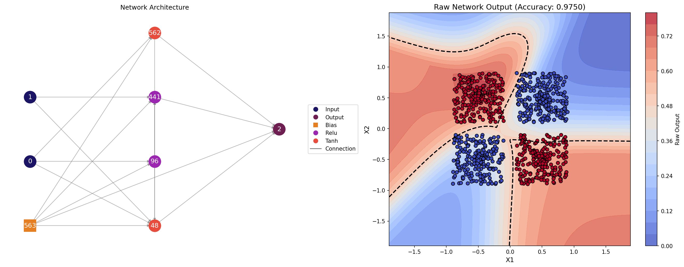
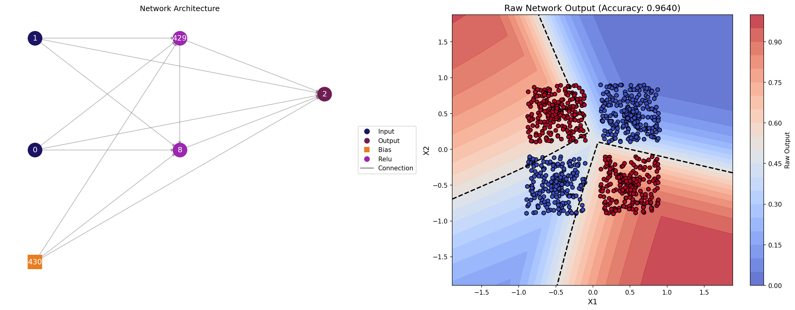

#### Two Circles

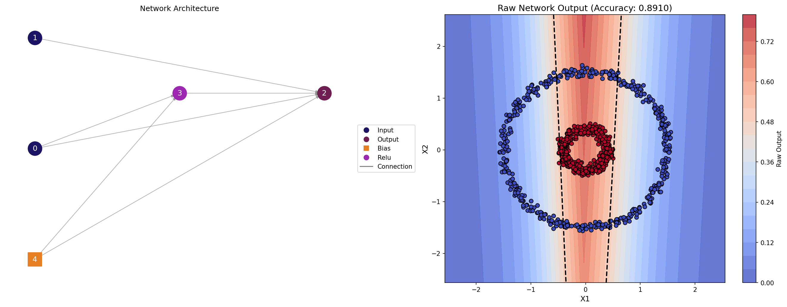
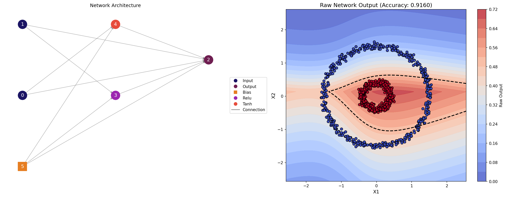
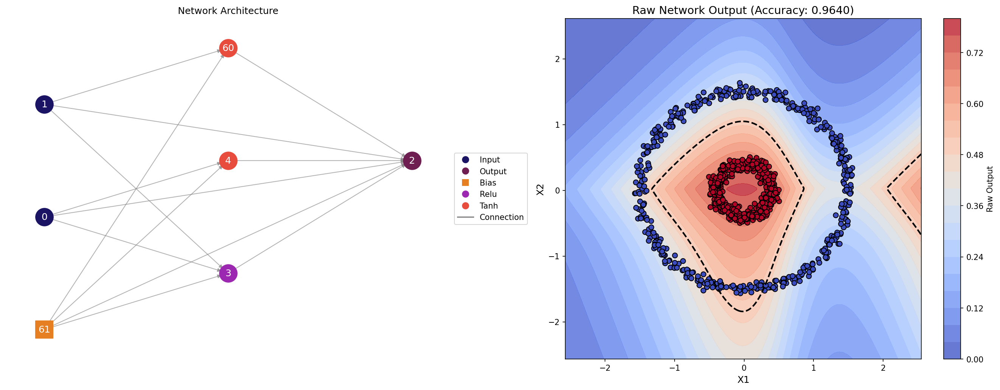

#### Spiral


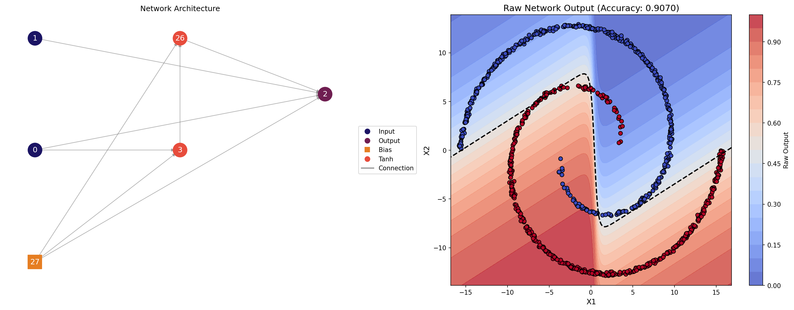
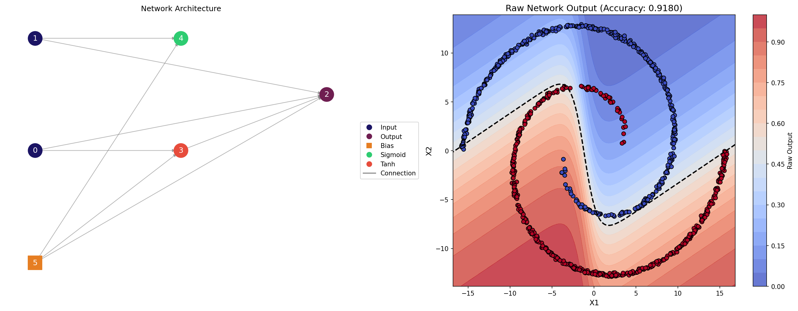
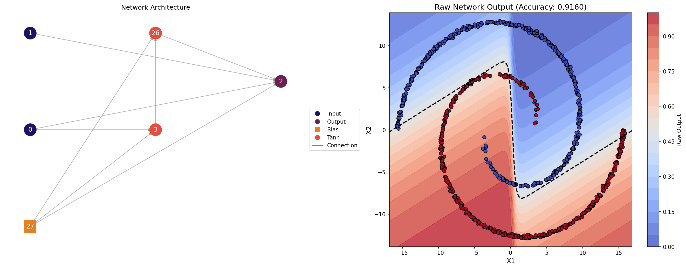
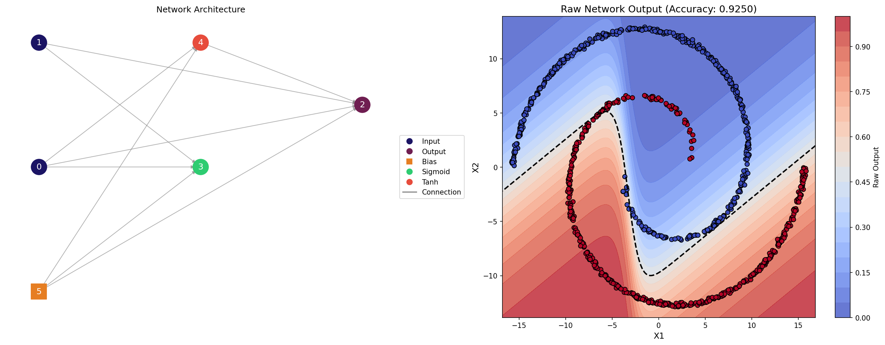
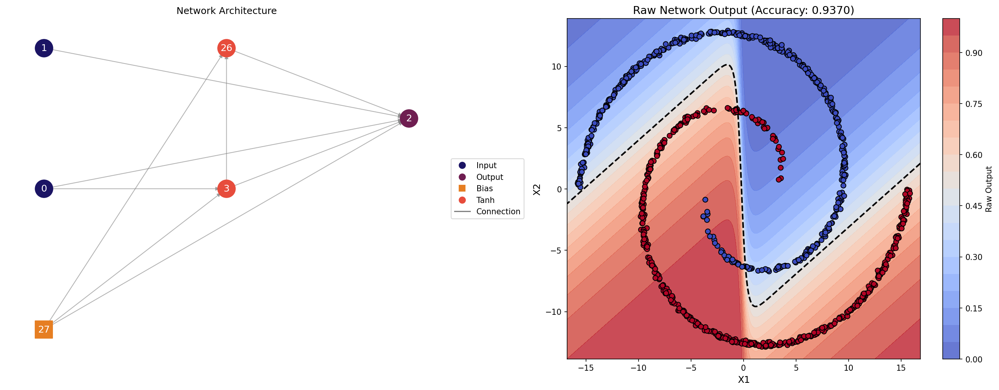

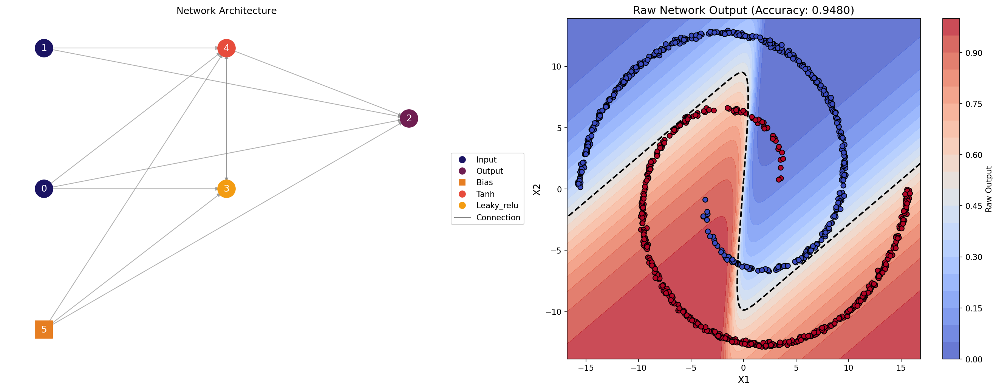
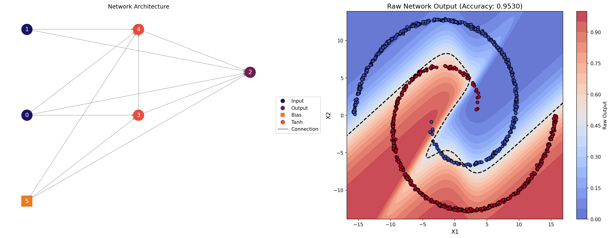
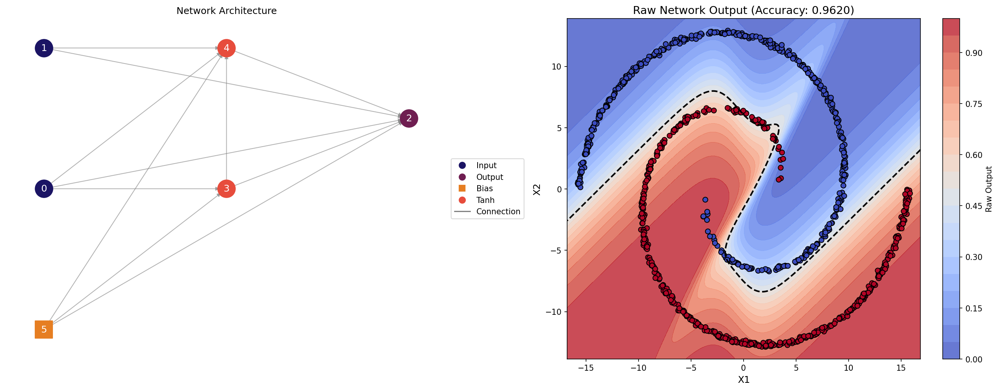

